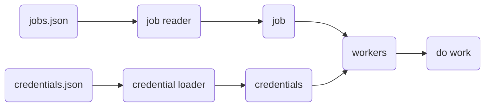

# Seli

<h1 align="center">
    extendable selenium worker
</h1>

---

## Workflow

```mermaid
flowchart LR
  1(jobs.json) --> 3;
  2(credentials.json) --> 4;
  3(job reader) --> 5;
  4(credential loader) --> 6;
  5(job) --> 7;
  6(credentials) --> 7;
  7(workers) --> 8(do work)
```
