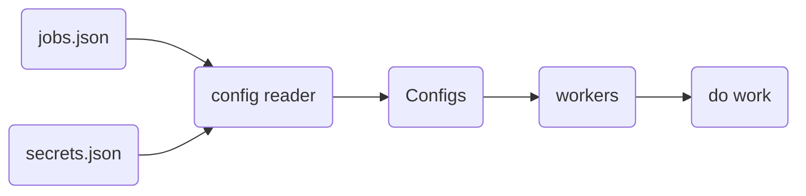

# Seli
<p align="center">
  
  
</p>
<h1 align="center">
    configurable selenium workers
</h1>

---

## Installation Options

*Example using windows. Commands may have to be tweaked for linux or mac systems*

=== "Clone Repo and Install with Poetry"

    ```sh
    git clone https://github.com/yemaney/seli.git
    cd seli
    poetry install
    ```

=== "Download whl"

    - download .whl from github repo [seli-2.0.0-py3-none-any.whl](https://github.com/yemaney/seli/blob/main/dist/seli-2.0.0-py3-none-any.whl)
    ```sh
    python -m venv .venv
    source .venv/Scripts/activate
    pip install seli-2.0.0-py3-none-any.whl
    ```

---

## Usage

=== "No arguments"

    

=== "help"

    

=== "all arguments"

    

---

## Workflow



1. Read configs
2. Create Configs objects with the data required to execute a job
3. Workers use config input to perform jobs

---

## Secrets

In case you don't want to save sensitive information with the rest of the job configuration
seli supports a simple secrets interface.

1. Use `secret` field instead of `text` in jobs config
2. Have the `secret` field value be a unique name for the secret
3. Have a secrets JSON with a `key that matches the secrets name`

!!! info inline end "secrets JSON"

    ```json
    {
        "password": "123456"
    }
    ```

```json
// jobs JSON
{
    "kind" : "field",
    "xpath" : "/html/input",
    "secret" : "password"
}
```

---

## Jobs JSON Schema

```json
{
    "jobs": [workers...]
}

```


!!! info "workers"

    === "browser"
        Used to search a url using the address bar.

        ``` json
        {
            "kind": "browser",
            "url": "https://www.youtube.com/"
        }
        ```

    === "button"
        Used to click a button.

        ``` json
        {
            "kind" : "button",
            "xpath" : "//*[@id='buttons']/ytd-button-renderer"
        }
        ```

    === "field"
        Used to enter text into an input field.

        Normal text.
        ``` json
        {
            "kind" : "field",
            "xpath" : "//*[@id='identifierId']",
            "text" : "username"
        }
        ```

        If input text is a secret.
        ``` json
        {
            "kind" : "field",
            "xpath" : "//*[@id='identifierId']",
            "secret" : "username"
        }
        ```

## Examples

Both examples showcase a workflow to:

1. browse to [google.com](https://www.google.com/)
2. enter "charmerder" into the search bar
3. click the Goggle Search button

*One example uses just a jobs JSON config file, while the other also uses a secrets JSON
config file.*

### With Normal Text

??? "Jobs JSON file"

    ```json
    {
        "jobs": [
            {
                "kind": "browser",
                "url": "https://www.google.com/"
            },
            {
                "kind" : "field",
                "xpath" : "/html/body/div[1]/div[3]/form/div[1]/div[1]/div[1]/div/div[2]/input",
                "text" : "charmander"
            },
            {
                "kind" : "button",
                "xpath" : "/html/body/div[1]/div[3]/form/div[1]/div[1]/div[3]/center/input[1]"
            }
        ]
    }
    ```

??? "Output logs.log File"

    ```log
    2022-09-05:12:44:18, 511 INFO     [seli.config_readers:69] reading sys.argv
    2022-09-05:12:44:18, 512 INFO     [seli.config_readers:47] job config found
    2022-09-05:12:44:18, 512 INFO     [seli.workers:61] browser_worker at https://www.google.com/
    2022-09-05:12:44:20, 62 INFO     [seli.workers:61] field_worker at /html/body/div[1]/div[3]/form/div[1]/div[1]/div[1]/div/div[2]/input
    2022-09-05:12:44:20, 170 INFO     [seli.workers:61] button_worker at /html/body/div[1]/div[3]/form/div[1]/div[1]/div[3]/center/input[1]
    ```

### With Secret Text

??? "Jobs JSON file"

    ```json
    {
        "jobs": [
            {
                "kind": "browser",
                "url": "https://www.google.com/"
            },
            {
                "kind" : "field",
                "xpath" : "/html/body/div[1]/div[3]/form/div[1]/div[1]/div[1]/div/div[2]/input",
                "secret" : "pokemon"
            },
            {
                "kind" : "button",
                "xpath" : "/html/body/div[1]/div[3]/form/div[1]/div[1]/div[3]/center/input[1]"
            }
        ]
    }
    ```

??? "Secrets JSON file"

    ```json
    {
        "pokemon" : "charmander"
    }
    ```

??? "Output logs.log File"

    ```log
    2022-09-05:12:47:01, 294 INFO     [seli.config_readers:69] reading sys.argv
    2022-09-05:12:47:01, 295 INFO     [seli.config_readers:47] job config found
    2022-09-05:12:47:01, 296 INFO     [seli.config_readers:57] secrets config found
    2022-09-05:12:47:01, 297 INFO     [seli.workers:61] browser_worker at https://www.google.com/
    2022-09-05:12:47:02, 637 INFO     [seli.workers:61] field_worker at /html/body/div[1]/div[3]/form/div[1]/div[1]/div[1]/div/div[2]/input
    2022-09-05:12:47:02, 741 INFO     [seli.workers:61] button_worker at /html/body/div[1]/div[3]/form/div[1]/div[1]/div[3]/center/input[1]
    ```
