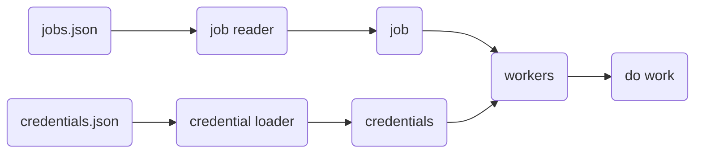

# Seli
<p align="center">
  
  
</p>
<h1 align="center">
    configurable selenium workers
</h1>

---

## Workflow



---

## Jobs JSON Schema

```json
{
    "jobs": [workers...]
}

```


!!! info "workers"

    === "browser"
        Used to search a url using the address bar.

        ``` json
        {
            "kind": "browser",
            "url": "https://www.youtube.com/"
        }
        ```

    === "button"
        Used to click a button.

        ``` json
        {
            "kind" : "button",
            "xpath" : "//*[@id='buttons']/ytd-button-renderer"
        }
        ```

    === "field"
        Used to click a button.

        ``` json
        {
            "kind" : "field",
            "xpath" : "//*[@id='identifierId']",
            "text" : "username"
        }
        ```
